# Створення власних проектів
Вітаємо. Сьогоднішнє заняття дещо відрізняється від попередніх. Тому що на сьогоднішньому занятті ми будемо вчитися робити не заготовленні заняття, а будемо створювати власний проект та реалізовувати його.  Тобто, будемо створювати самі собі завдання. В результаті - в вас має бути побудоване якась давня будівля: ви можете обрати із запропонованих варіантів, або знайти свій.  
При цьому, при підготовці проекту ви можете частину задачі будувати вручну, а далі, описувати те, що ви побудували і створювати відповідні програми.  
  
В данному занятті ми трохи пригадаємо як створювати блоки за координатами, а далі - навчимося оцінювати розміри об'єктів на картинці (як на скріншотах від Майнкрафту, так і на реальних картинках).

Візьмемо простий скріншот з Майнкрафту:  
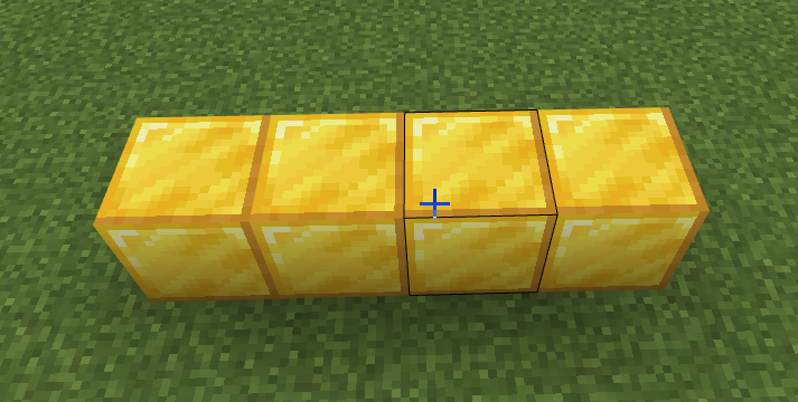  
  
За допомогою сервісу <a href = "https://www.photopea.com/">Photopea</a> позначимо потенційні відносні координати, щоб їх можна було створити в код білдері.  

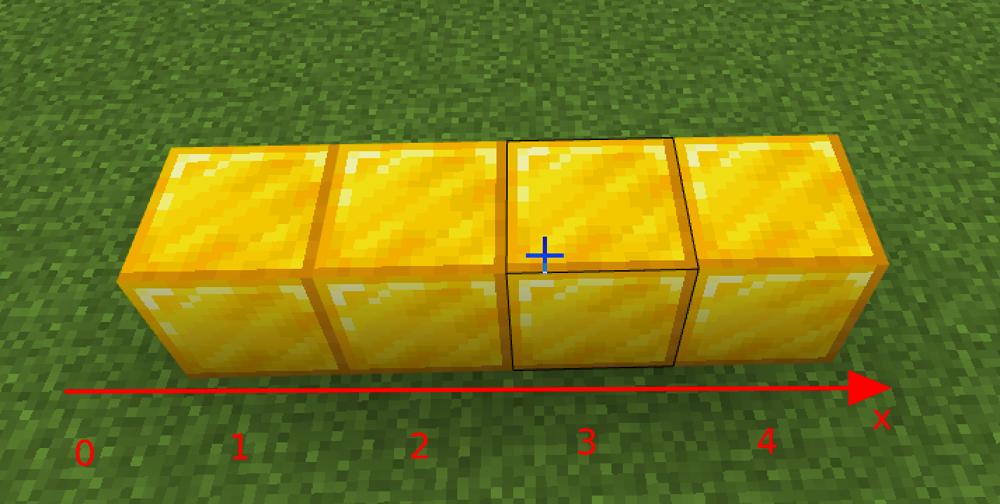  

Як ми бачимо наші блоки "тягнуться" від координати 1 до координати 4.

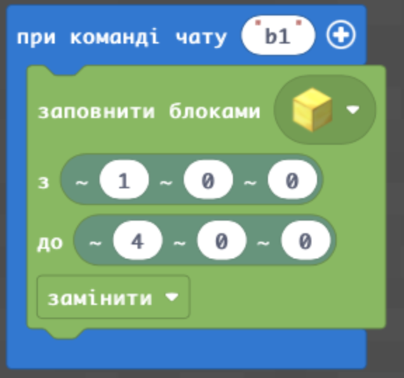  

Зазначимо, що координата х зазвичай йде горизонтально та позначається першою.

А які координати будуть у такого розположення блоків?  
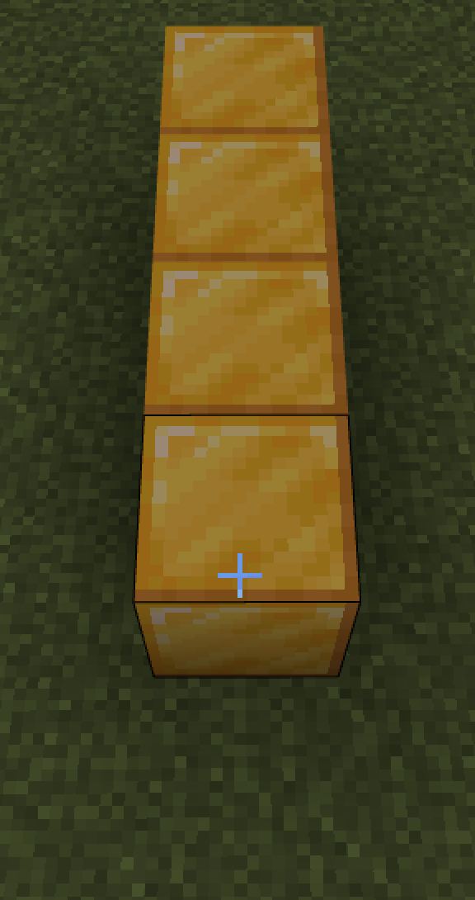  

А у такого?  

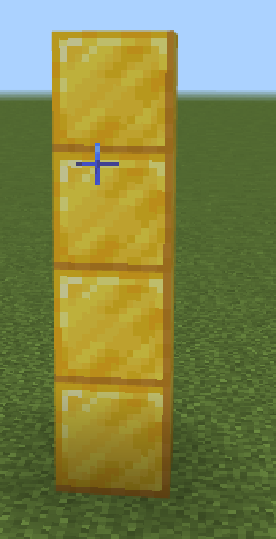  

Запишіть кодаи для створення наступних блоків:

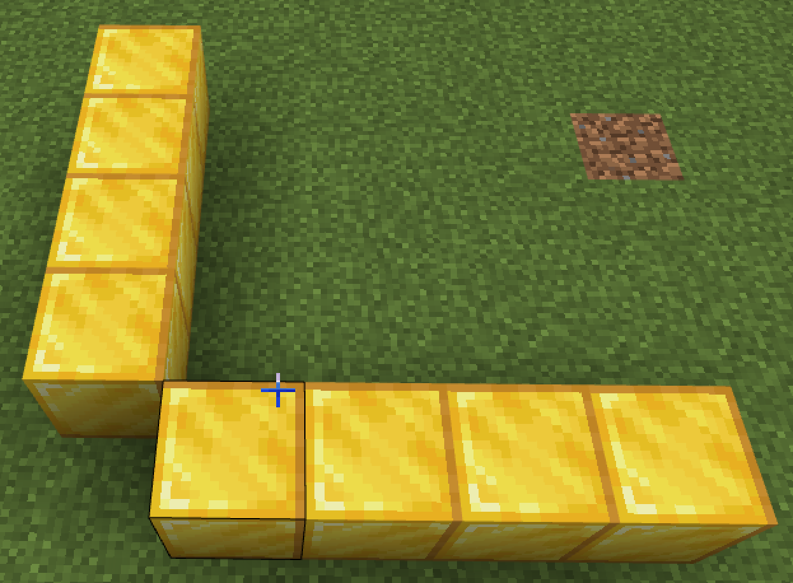  

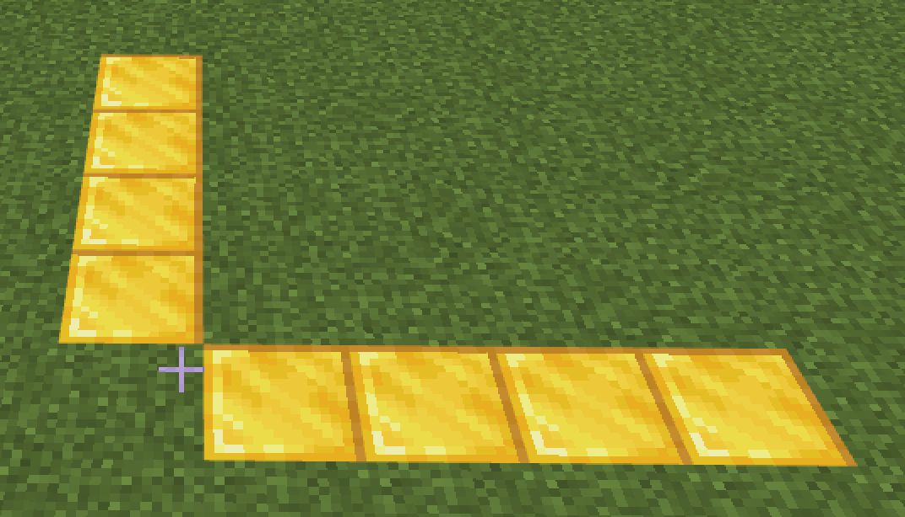  

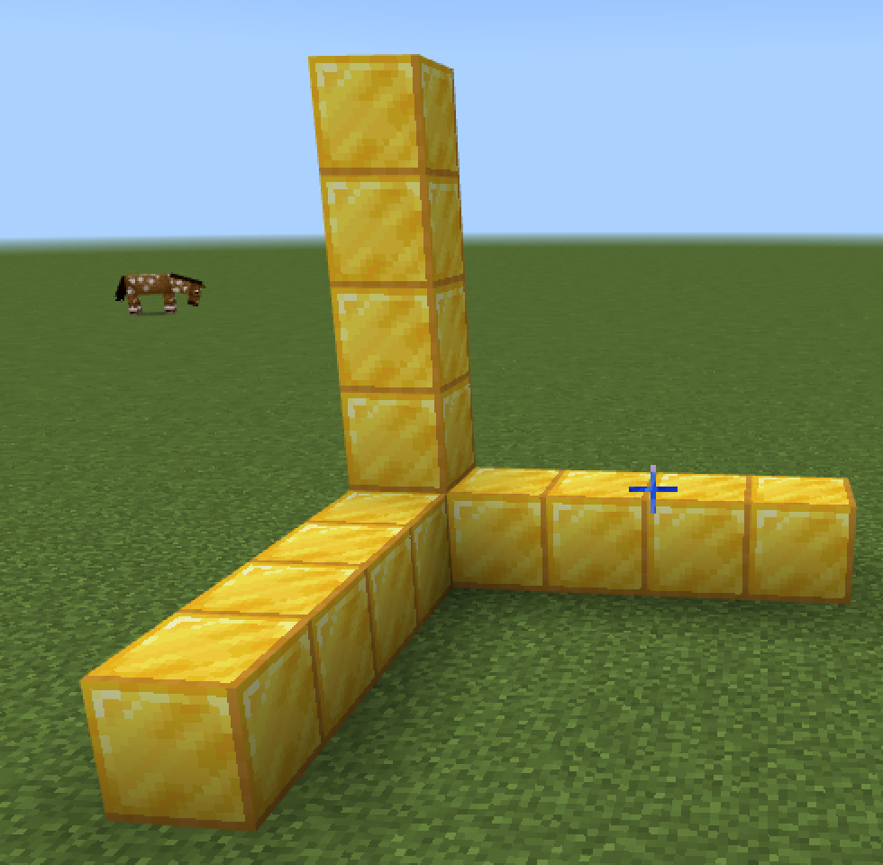  

## Кодування
Для того, щоб позначити цифрами майбктні координати: зробимо та збережемо скріншот.  
Після цього - відкриємо он-лайн редактор для роботи із зображеннями <a href = "https://www.photopea.com/" target = "_blank">PhotoPea</a>. Та в меню "Файл" оберемо пункт "Відкрити".
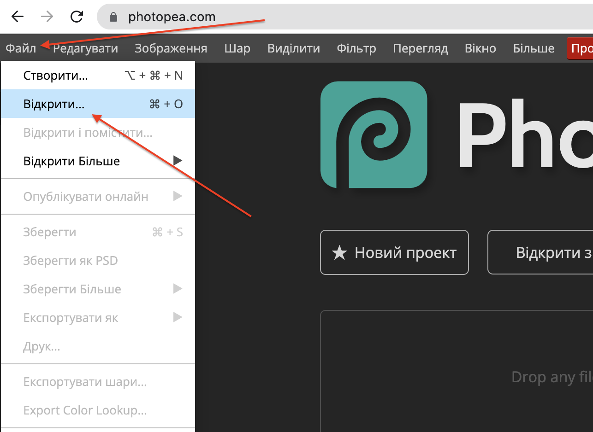

Оберемо файл створеного скріншоту:

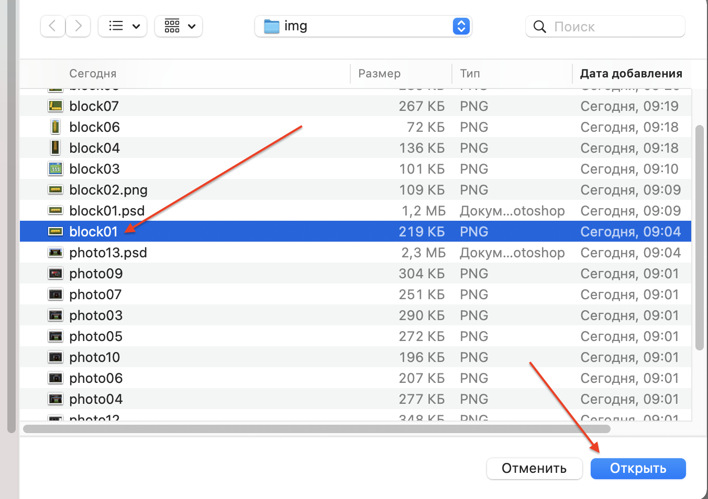

Оберемо інструмент T (текст), оберемо точку в якій поставимо необхідний символ, та збільшемо колір тексту на червоний (щоб текст було краще видно на картинці)

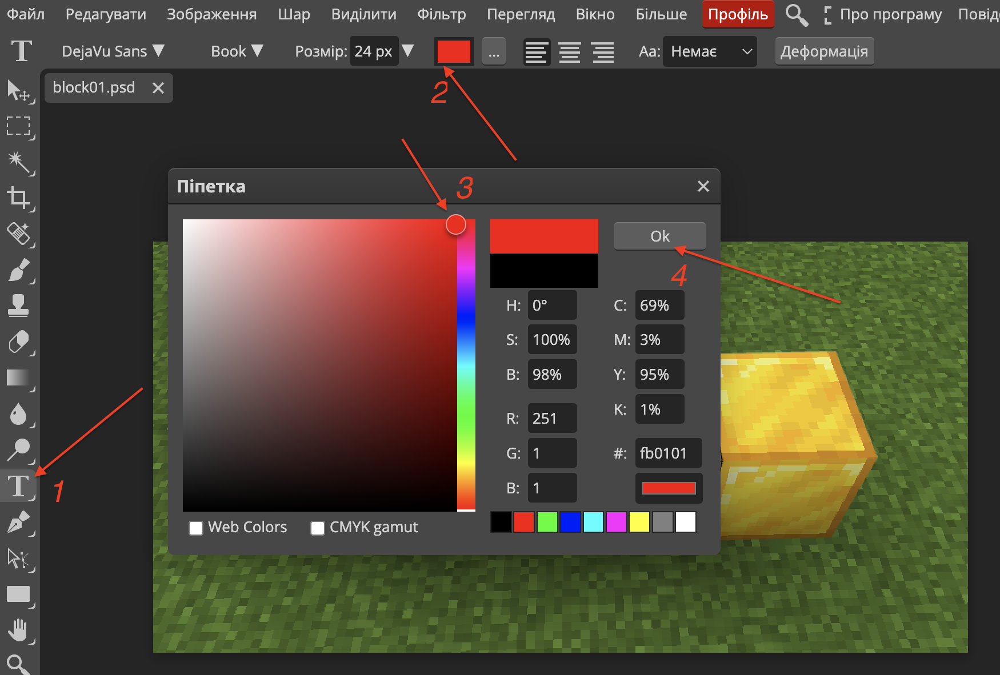   
Збільшемо розмір кольору  
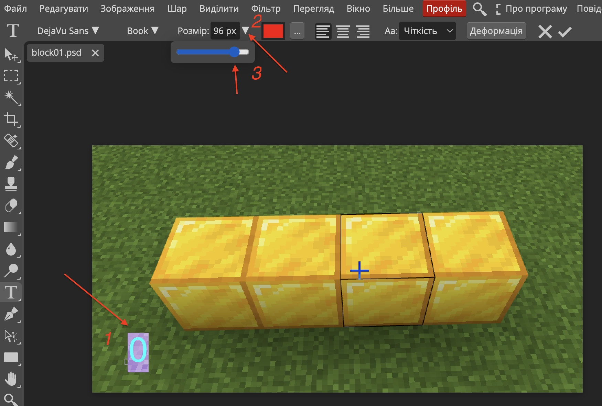  

За необхідністію використаємо інструмент пересування елементу на екрані по змінемо положення створеного символу
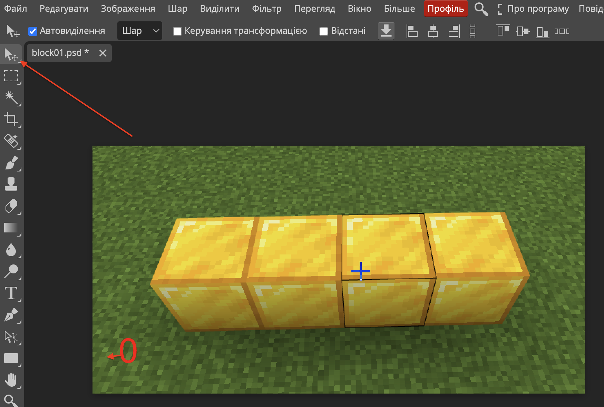

Позначемо повністю майбутні координати:

#### Для чого потрібне позначення координат?
Коли ви працюєте із зображеннями та відмічаєте на них координати блоків вам набагато легше зрозуміти як підбирати координати в кодах програми для створення відповідного елементу. Як тільки ви зможете робити це без використання графічного редактору - необхідність для його використання для вирішення цієї задачі відпаде.

## Творче завдання (на занятті):
1. Створіть вручну в Майнкрафті певний набір блоків (для початку - нескладний).
2. Зробіть його скріншот (за допомогою сервісу <a href = "https://monosnap.com/">monosnap</a> або <a herf = "https://app.prntscr.com/uk/">lightshot</a> або інших).
3. Скиньте посилання на скріншот до чату вашої групи та запропонуйте вашим друзям запрограмувати створений вами елемент.
4. Візьміть скріншот когось з ваших одногрупників та запрограмуйте його створення.

## Супертворче завдання.
1. Позначте координати на реальному зобрежанні растральної колони.  
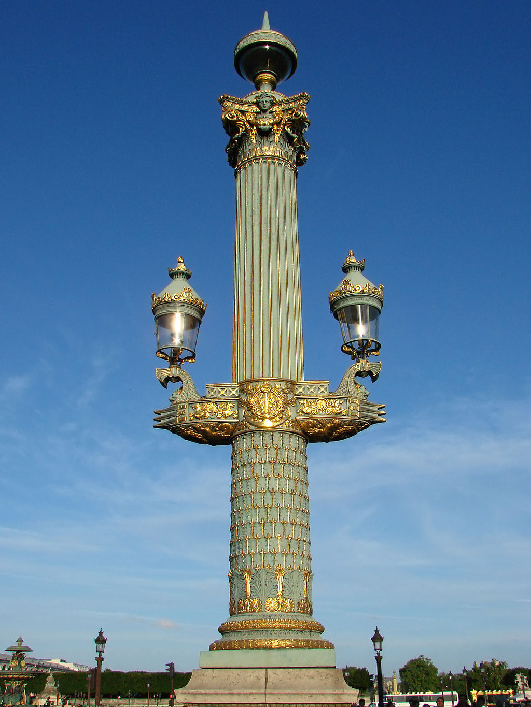  

2. Знайдіть в Інтернеті фотографію давньої будівлі (вона буде необхідна для виконання проекту). 
