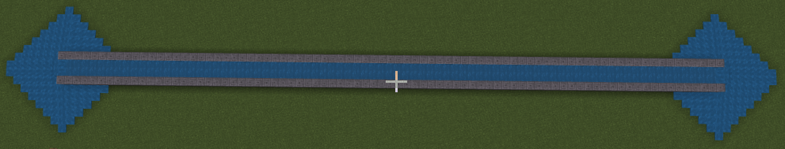

# Канали та акведуки.
Вода у всі часи була основою життя. 
|№|Завдання|Код|Результат|
|---|---|---|---|
|1.|1.&nbsp;Сформуйте канал від 40 до -40 відносно себе.  2.&nbsp;Сформуйте канал від 20 до -20 відносно себе.  3.&nbsp;Сформуйте канал від 0 до -20 відносно себе.|  | |

|№|Завдання|Код|Результат|
|---|---|---|---|
|2.|1. Додайте басейни 2x6 з країв каналу.  2. Додайте басейни 3x6 з країв каналу.  3. Додайте басейни 4x8 з країв каналу.  |   | |

## Цікаве завдання
* Створіть лодку та покатайтеся по каналу:  
  

## Мост із водою
|№|Завдання|Код|Результат|
|---|---|---|---|
|3.|1. Створіть підпорку для моста з водою висотою в 5 блоків, шириною в 81 блок (від -40 до 40 відносно вас),  шириною в 4 блока (від 2 до 5).  2. Створіть підпорку для моста з водою висотою в 5 блоків, довжиною в 41 блок (від -20 до 20 відносно вас), шириною в 4 блока (від 2 до 5).   3. Створіть підпорку для моста висотою в 7 блоків, довжиною в 50 блоків та шириною в 5 блоків. |  | |

## Мост із водою
|№|Завдання|Код|Результат|
|---|---|---|---|
|4.|1. Створіть квадратні підпорки для потока з водою. Шириною 5 блоків та із проміжками в 5 блоків.  2. Створіть квадратні підпорки для потока з водою. Шириною 6 блоків та із проміжками в 4 блоки.  3. Створіть квадратні підпорки для потока з водою. Шириною 3 блоки та із проміжками в 7 блоків. |    | |

## Мост зі сводом

|№|Завдання|Код|Результат|
|---|---|---|---|
|5.|1. Створіть підпорки для потока з водою із округлими підпоркам. |  |    |

