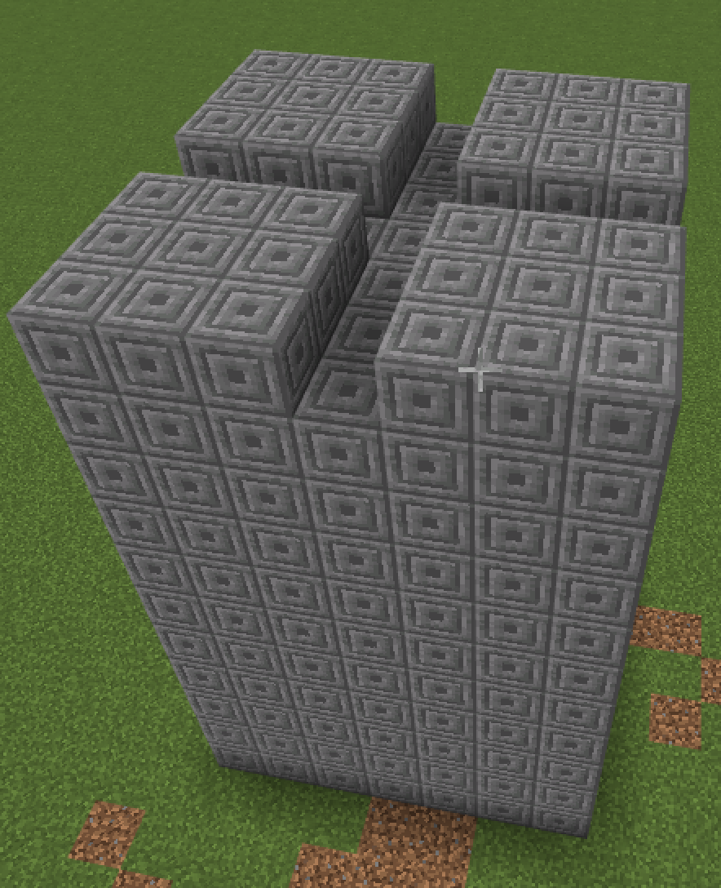
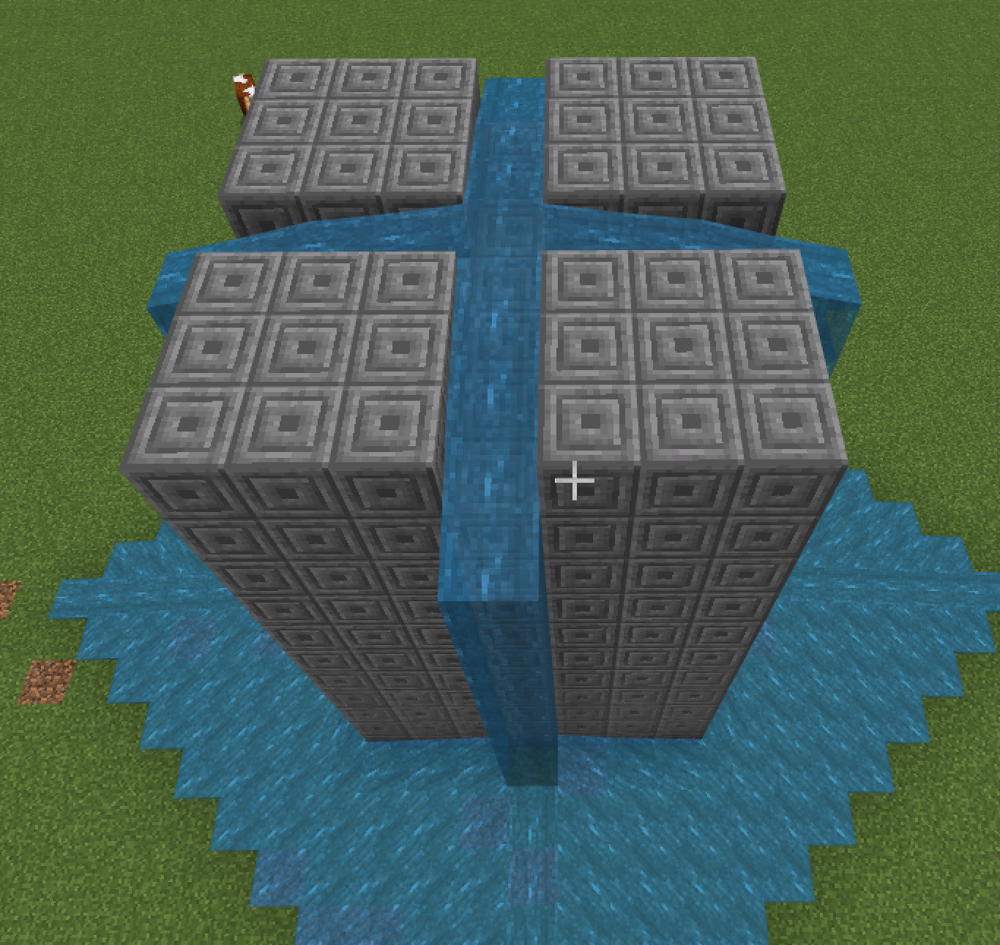
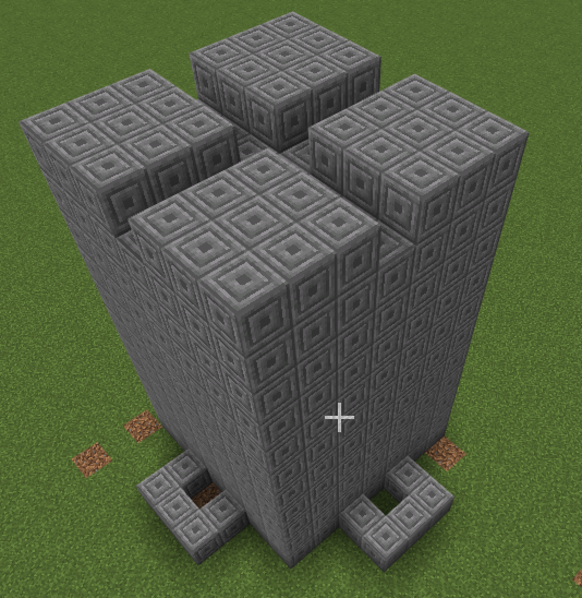
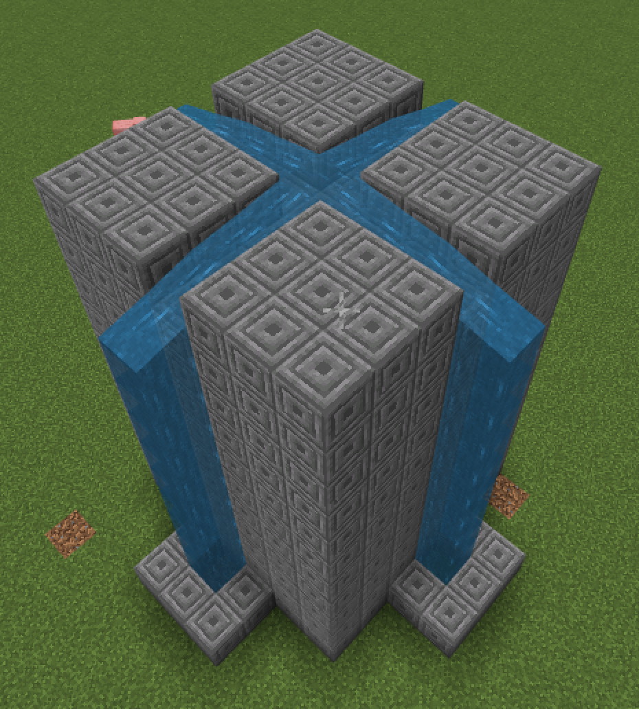
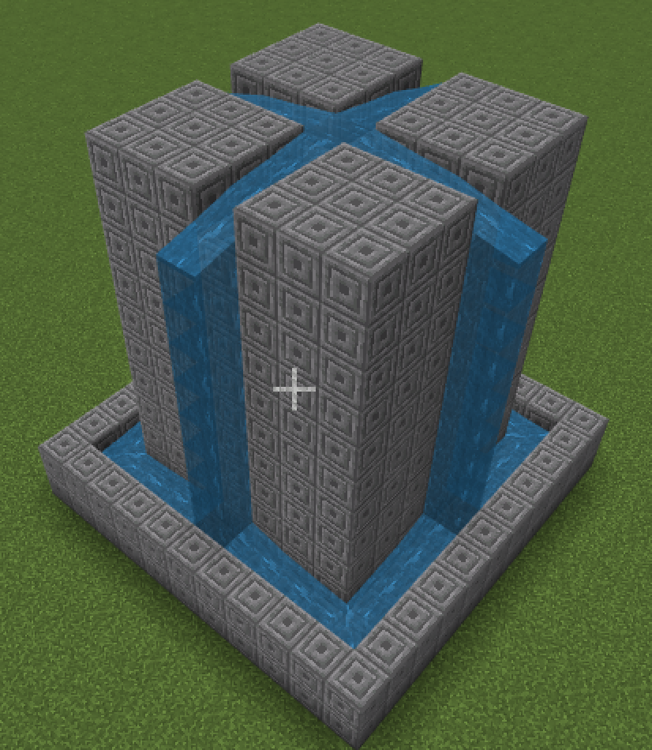
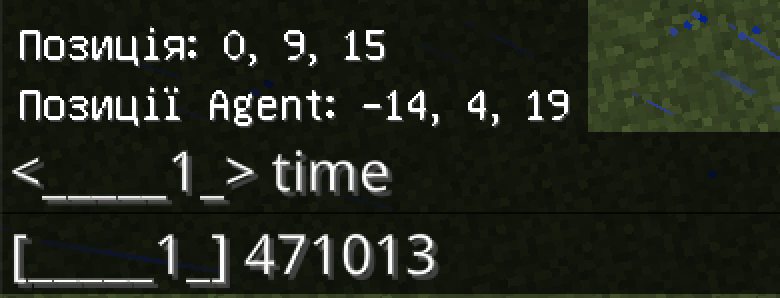
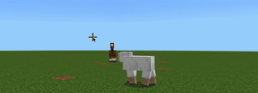

# Сади.
## Тестові питання.
1. Із допомогою якої функції можна поставити блок у визначеній точці?
```js
blocks.place(PLANKS_OAK, world(0, 0, 0))
```

2. Як викликати функцію при команді чату go.
```js
player.onChat("go", function () {
	
})
```
3. Як називаються команди до блоків:
Дошки:  
* - PLANKS_OAK
* - PLANKS_SPRUCE
* - PLANKS_BIRCH
* - PLANKS_JUNGLE
* - PLANKS_ACACIA
* - PLANKS_DARK_OAK

Для підказки - створіть код , що запускається за командою чату `go` та додайте до відповідних команд
```js
player.onChat("go", function () {
	blocks.place(PLANKS_OAK, world(0, 0, 0))
})
```

4. Каміння:

* GRASS, AIR, STONE, GRANITE, POLISHED_GRANITE, DIORITE, POLISHED_DIORITE, ANDESITE (андезіт)
* POLISHED_ANDESITE (полірований андезіт), DIRT (земля), COARSE_DIRT (кам'яниста земля), COBBLESTONE (кругляк)

## Заповнення блоками простір
* **CHISELED_STONE_BRICKS** - висічена кам'яна цегла
* **blocks.fill** - функція, що заповнює (`fill`) блоками (`blocks`)
* **world(10, 4, 20)** - з точки (10, 4, 20) за світовими координатами
* **world(-10, 4, 20)** - до точки (-10, 4, 20) за світовими координатами

```js
player.onChat("line", function () {
    blocks.fill(
    CHISELED_STONE_BRICKS,
    world(10, 4, 20),
    world(-10, 4, 20),
    FillOperation.Replace
    )
})
```


### Питання. 
* Яка довжина в блоках створеної лінії?

#### Додаткові завдання:
1. Створіть лінію довжиною в 11 блоків.
2. Створіть лінію довжиною в 6 блоків. 
3. Створіть лінію довжиною в 2 блоки. 

Зверніть увагу на те, що зміни проходять тільки по вісі X. Це дозволяє створювати лінію. Якщо іде зміна по двох координатах - получається фігура на площині.

```js
player.onChat("q", function () {
    blocks.fill(
    CHISELED_STONE_BRICKS,
    world(10, 4, 40),
    world(-10, 4, 30),
    FillOperation.Replace
    )
})
```


#### Питання
1. Який розмір створеного блока?


#### Додаткові завдання:
1. Створіть квадрат 11х11.
2. Створять прямокутник 6х11.
3. Створіть прямокутник 6х16.


## Фонтан
* **CHISELED_STONE_BRICKS** - висічена кам'яна цегла
* **AIR** - повітря
* **WATER** - вода


```js
player.onChat("fountain", function () {
    blocks.fill(
    CHISELED_STONE_BRICKS,
    world(5, 4, 5),
    world(-5, 5, -5),
    FillOperation.Replace
    )
    blocks.fill(
    AIR,
    world(4, 5, 4),
    world(-4, 5, -4),
    FillOperation.Replace
    )
    blocks.place(WATER, world(0, 8, 0))
})
```


#### Творчі завдання
1. Створіть фонтан. Базова частина від (5;4;5) до (-5;5;-5) із заглибленням в один блок від (4;5;4) до (-4;5;-4) з наповненням води з точки (0;8;0)
2. Створіть широкий фонтан. Базова частина від (7;4;7) до (-7;6;-7) із заглибленням в два блоки від (6;5;6) до (-6;4;-6) з наповненням води з точки (0;9;0).
3. Створіть вузький фонтан. Базова частина від (3;4;3) до (-3;7;-3) із заглибленням в три блоки від (2;6;2) до (-2;4;-2) з наповненням води з точки (0;10;0).

## Творче завдання
1. Створіть фонтан не квадартної форми.
2. Створіть фонтан круглої форми.

## Супер-творче завдання
1. Зробіть фонтани (обведено синім) та зелені насадження (обведено зеленим) як на привокзальній площі Харкова.


2. Оберіть будь-який парк із фонтанами в світі, та за його фотографією реалізуйте його репліку в Майнкрафті.


## Башта із водою

#|Завдання|Код|Результат|
|---|---|---|---|
|2.|1. Побудуйте башту (від точки (23;4;23) до точки  (17;14;17)): башта 7х7 із висотою 11 блоків. Із прорізями для майбутнього фонтану: від (23;14;20) до (17;14;20) та від (20;14;23) до (20;14;17)<br> 2. Побудуйте баштй 10х10 із висотою 5 блоків із прорізами, що йдуть навхрест через центр башти.<br> 3. Перенесіть одну з побудованих башт на 20 блоків за одним з вимірів (x або z)| **Код №1**  | |


**Код №1**
```js
player.onChat("tower", function () {
    blocks.fill(
    CHISELED_STONE_BRICKS,
    world(23, 4, 23),
    world(17, 14, 17),
    FillOperation.Replace
    )
    blocks.fill(
    AIR,
    world(23, 14, 20),
    world(17, 14, 20),
    FillOperation.Replace
    )
    blocks.fill(
    AIR,
    world(20, 14, 23),
    world(20, 14, 17),
    FillOperation.Replace
    )
})


```

### Творчі завдання:
1. Залийте прорізи водою (візьміть в інвентарі відро з водою чи додайте блок із водою).  

2. Додайте більше прорізів (так, щоб вони проходили через один блок).

## Ванни для води
Для того, щоб вода не розивалася при течії з будівлі додамо ванни для води.
#|Завдання|Код|Результат|
|---|---|---|---|
|3.|1. Додайте блоки ванни для збору води.|**Код №2**||
|4.|1. Запустіть з башти до ванн.|**Код №3**||

**Код №2**
```js
player.onChat("bath", function () {
    blocks.fill(
    CHISELED_STONE_BRICKS,
    world(21, 4, 15),
    world(19, 4, 16),
    FillOperation.Replace
    )
    blocks.place(AIR, world(20, 4, 16))
    blocks.fill(
    CHISELED_STONE_BRICKS,
    world(24, 4, 21),
    world(25, 4, 19),
    FillOperation.Replace
    )
    blocks.place(AIR, world(24, 4, 20))
    blocks.fill(
    CHISELED_STONE_BRICKS,
    world(21, 4, 24),
    world(19, 4, 25),
    FillOperation.Replace
    )
    blocks.place(AIR, world(20, 4, 24))
    blocks.fill(
    CHISELED_STONE_BRICKS,
    world(16, 4, 21),
    world(15, 4, 19),
    FillOperation.Replace
    )
    blocks.place(AIR, world(16, 4, 20))
})
```
**Код №3**

```js
player.onChat("watertower", function () {
    blocks.fill(
    CHISELED_STONE_BRICKS,
    world(23, 4, 23),
    world(17, 14, 17),
    FillOperation.Replace
    )
    blocks.fill(
    AIR,
    world(23, 14, 20),
    world(17, 14, 20),
    FillOperation.Replace
    )
    blocks.fill(
    AIR,
    world(20, 14, 23),
    world(20, 14, 17),
    FillOperation.Replace
    )
    blocks.place(WATER, world(20, 14, 20))
})

```
## Творче завдання
1. Поєднайте координату фонтану та координати башти із водою, щоб результ відповідав наступні картинці:  



## Робота із часом
В Minecraft є час. Найпростіша можливість познайомитись із часом - це вивести на екран поточне значення ігорового часу:
```js
player.onChat("time", function () {
    player.say(gameplay.timeQuery(GAME_TIME))
})
```




## "Живі" фонтани та час.
Найцікавішими фонтанами є ті, які працюють не постійно, а з певною періодичністю.
#|Завдання|Код|Результат|
|---|---|---|---|
|4|1. Запрограмуйте появу води, та зникнення її (заповнення місць появи води повітрям) з інтервалом 3 секунди. <br> 2. Запрограмуйте появу води, та зникнення її (заповнення місць появи води повітрям) з інтервалом 5 секунди. <br>3. Запрограмуйте появу води, та зникнення її (заповнення місць появи води повітрям) так щоб вод з'являлася на 5 секунд, а зникала на 3 секунди|**Код №4**||

**Код №4**
```js
loops.forever(function () {
    blocks.fill(
    AIR,
    world(30, 4, 0),
    world(30, 7, 0),
    FillOperation.Replace
    )
    loops.pause(3000)
    blocks.fill(
    WATER,
    world(30, 4, 0),
    world(30, 7, 0),
    FillOperation.Replace
    )
    loops.pause(3000)
})

```

## Творче завдання
1. Реалзуйте запрограмовані фонтани (поява/зникання води на площі, яку ви програмували в першому завданні)


## Ускладнене завдання (додаткове)
1. Реалізуйте появу та зникнення води, спираючись на ігровий час.
Крок 1. Вивід тексту на еркан.
```js
loops.forever(function () {
    time = Math.idiv(gameplay.timeQuery(GAME_TIME), 100)
    mod = time % 10
    if (mod % 2 == 0) {
        if (active == 1) {
            player.say("Парні")
            active = 0
        }
    } else {
        if (active == 0) {
            player.say("Непарні")
            active = 1
        }
    }
})


```

Крок 2. Поява та зникнення води:

```js
loops.forever(function () {
    time = Math.idiv(gameplay.timeQuery(GAME_TIME), 100)
    mod = time % 10
    if (mod % 2 == 0) {
        if (active == 1) {
            blocks.fill(
            AIR,
            world(50, 4, 0),
            world(50, 7, 0),
            FillOperation.Replace
            )
            active = 0
        }
    } else {
        if (active == 0) {
            blocks.fill(
            WATER,
            world(50, 4, 0),
            world(50, 7, 0),
            FillOperation.Replace
            )
            active = 1
        }
    }
})

```


