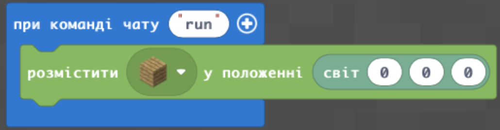
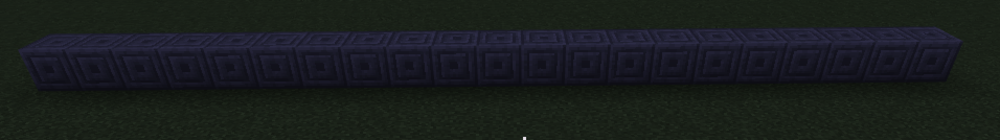
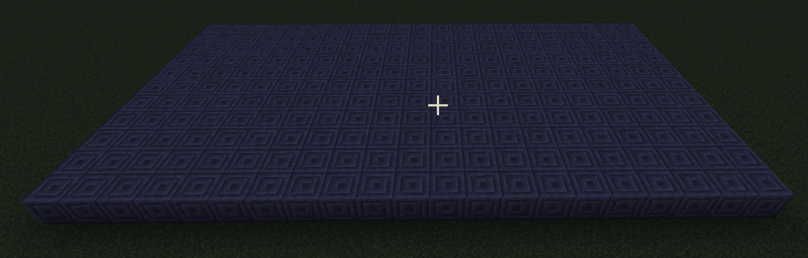
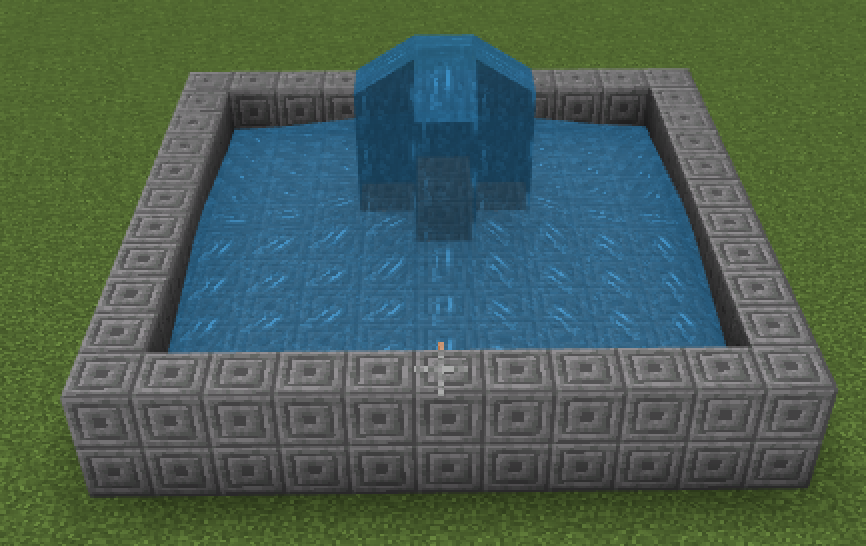
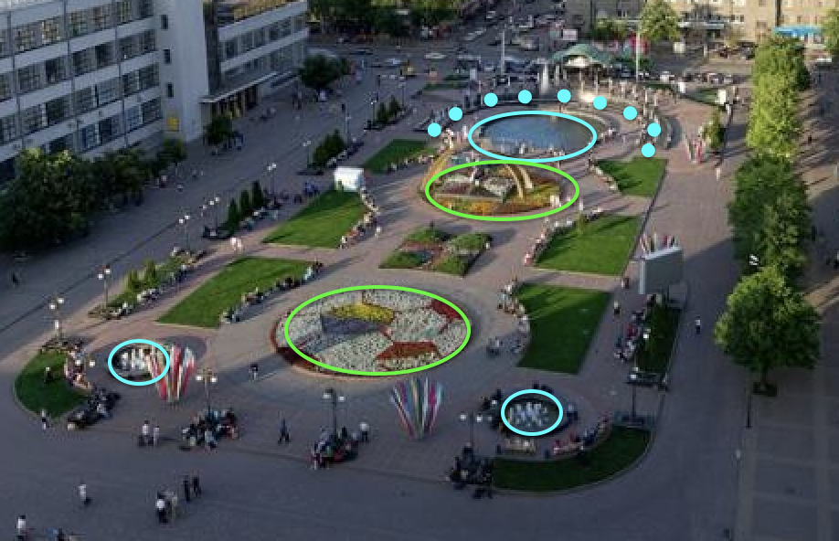

# Сади.
## Тестові питання.
1. Із допомогою якої функції можна поставити блок у визначеній точці?
```js
blocks.place(PLANKS_OAK, world(0, 0, 0))
```

2. Як викликати функцію при команді чату go.
```js
player.onChat("go", function () {
	
})
```
3. Як називаються команди до блоків:
Дошки:  
* - PLANKS_OAK
* - PLANKS_SPRUCE
* - PLANKS_BIRCH
* - PLANKS_JUNGLE
* - PLANKS_ACACIA
* - PLANKS_DARK_OAK

Для підказки - створіть код , що запускається за командою чату `go` та додайте до відповідних команд
```js
player.onChat("go", function () {
	blocks.place(PLANKS_OAK, world(0, 0, 0))
})
```

4. Каміння:

* GRASS, AIR, STONE, GRANITE, POLISHED_GRANITE, DIORITE, POLISHED_DIORITE, ANDESITE (андезіт)
* POLISHED_ANDESITE (полірований андезіт), DIRT (земля), COARSE_DIRT (кам'яниста земля), COBBLESTONE (кругляк)

## Заповнення блоками простір
* **CHISELED_STONE_BRICKS** - висічена кам'яна цегла
* **blocks.fill** - функція, що заповнює (`fill`) блоками (`blocks`)
* **world(10, 4, 20)** - з точки (10, 4, 20) за світовими координатами
* **world(-10, 4, 20)** - до точки (-10, 4, 20) за світовими координатами

```js
player.onChat("line", function () {
    blocks.fill(
    CHISELED_STONE_BRICKS,
    world(10, 4, 20),
    world(-10, 4, 20),
    FillOperation.Replace
    )
})
```


### Питання. 
* Яка довжина в блоках створеної лінії?

#### Додаткові завдання:
1. Створіть лінію довжиною в 11 блоків.
2. Створіть лінію довжиною в 6 блоків. 
3. Створіть лінію довжиною в 2 блоки. 

Зверніть увагу на те, що зміни проходять тільки по вісі X. Це дозволяє створювати лінію. Якщо іде зміна по двох координатах - получається фігура на площині.

```js
player.onChat("q", function () {
    blocks.fill(
    CHISELED_STONE_BRICKS,
    world(10, 4, 40),
    world(-10, 4, 30),
    FillOperation.Replace
    )
})
```



#### Питання
1. Який розмір створеного блока?


#### Додаткові завдання:
1. Створіть квадрат 11х11.
2. Створять прямокутник 6х11.
3. Створіть прямокутник 6х16.


## Фонтан
* **CHISELED_STONE_BRICKS** - висічена кам'яна цегла
* **AIR** - повітря
* **WATER** - вода


```js
player.onChat("fountain", function () {
    blocks.fill(
    CHISELED_STONE_BRICKS,
    world(5, 4, 5),
    world(-5, 5, -5),
    FillOperation.Replace
    )
    blocks.fill(
    AIR,
    world(4, 5, 4),
    world(-4, 5, -4),
    FillOperation.Replace
    )
    blocks.place(WATER, world(0, 8, 0))
})
```



#### Творчі завдання
1. Створіть фонтан. Базова частина від (5;4;5) до (-5;5;-5) із заглибленням в один блок від (4;5;4) до (-4;5;-4) з наповненням води з точки (0;8;0)
2. Створіть широкий фонтан. Базова частина від (7;4;7) до (-7;6;-7) із заглибленням в два блоки від (6;5;6) до (-6;4;-6) з наповненням води з точки (0;9;0).
3. Створіть вузький фонтан. Базова частина від (3;4;3) до (-3;7;-3) із заглибленням в три блоки від (2;6;2) до (-2;4;-2) з наповненням води з точки (0;10;0).

## Творче завдання
1. Створіть фонтан не квадартної форми.
2. Створіть фонтан круглої форми.

## Супер-творче завдання
1. Зробіть фонтани (обведено синім) та зелені насадження (обведено зеленим) як на привокзальній площі Харкова.


2. Оберіть будь-який парк із фонтанами в світі, та за його фотографією реалізуйте його репліку в Майнкрафті.
