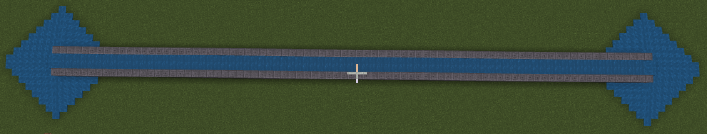
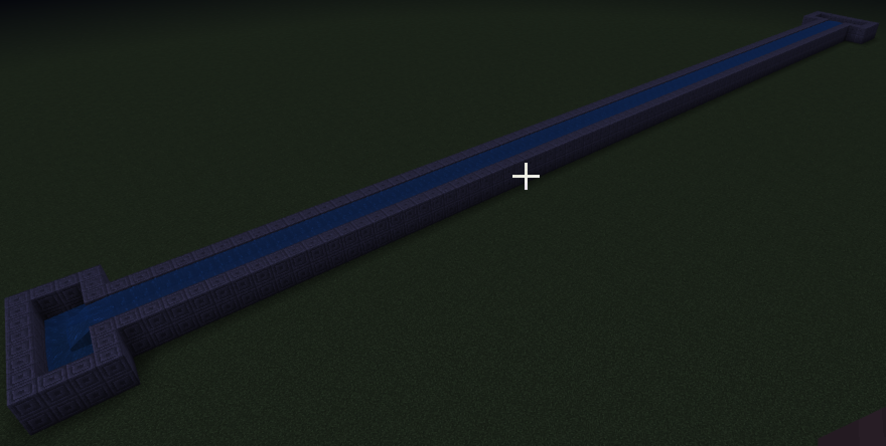
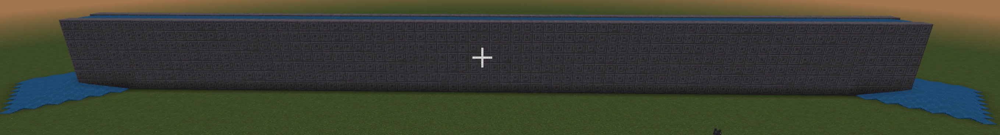
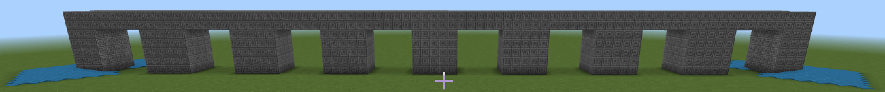
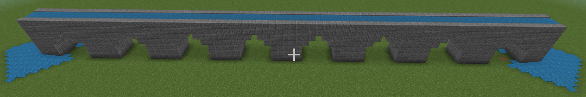
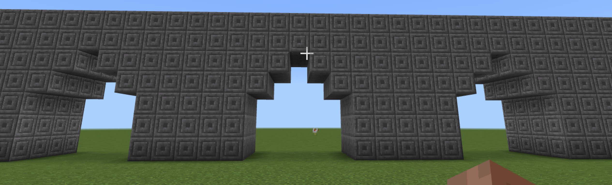

# Канали та акведуки.
Вода у всі часи була основою життя. 
|№|Завдання|Код|Результат|
|---|---|---|---|
|1.|1.&nbsp;Сформуйте канал від 40 до -40 відносно себе. <br>2.&nbsp;Сформуйте канал від 20 до -20 відносно себе.<br> 3.&nbsp;Сформуйте канал від 0 до -20 відносно себе.| **Код №1** | |
**Код №1**
```js
player.onChat("channel", function () {
    blocks.fill(
    CHISELED_STONE_BRICKS,
    pos(5, 0, -40),
    pos(5, 1, 40),
    FillOperation.Replace
    )
    blocks.fill(
    CHISELED_STONE_BRICKS,
    pos(4, 0, -40),
    pos(3, 0, 40),
    FillOperation.Replace
    )
    blocks.fill(
    WATER,
    pos(4, 1, -40),
    pos(3, 1, 40),
    FillOperation.Replace
    )
    blocks.fill(
    CHISELED_STONE_BRICKS,
    pos(2, 0, -40),
    pos(2, 1, 40),
    FillOperation.Replace
    )
})


```


|№|Завдання|Код|Результат|
|---|---|---|---|
|2.|1. Додайте басейни 2x6 з країв каналу.<br> 2. Додайте басейни 3x6 з країв каналу.<br> 3. Додайте басейни 4x8 з країв каналу.  |**Код №2** **Код №3** | |
**Код №2**
```js
player.onChat("bath1", function () {
    blocks.fill(
    CHISELED_STONE_BRICKS,
    pos(0, 0, 43),
    pos(7, 1, 43),
    FillOperation.Replace
    )
    blocks.fill(
    CHISELED_STONE_BRICKS,
    pos(0, 0, 43),
    pos(0, 1, 40),
    FillOperation.Replace
    )
    blocks.fill(
    CHISELED_STONE_BRICKS,
    pos(7, 0, 43),
    pos(7, 1, 40),
    FillOperation.Replace
    )
    blocks.fill(
    CHISELED_STONE_BRICKS,
    pos(7, 0, 40),
    pos(5, 1, 40),
    FillOperation.Replace
    )
    blocks.fill(
    CHISELED_STONE_BRICKS,
    pos(2, 0, 40),
    pos(0, 1, 40),
    FillOperation.Replace
    )
})

```
**Код №3**

```js
player.onChat("bath2", function () {
    blocks.fill(
    CHISELED_STONE_BRICKS,
    pos(0, 0, -43),
    pos(7, 1, -43),
    FillOperation.Replace
    )
    blocks.fill(
    CHISELED_STONE_BRICKS,
    pos(0, 0, -43),
    pos(0, 1, -40),
    FillOperation.Replace
    )
    blocks.fill(
    CHISELED_STONE_BRICKS,
    pos(7, 0, -43),
    pos(7, 1, -40),
    FillOperation.Replace
    )
    blocks.fill(
    CHISELED_STONE_BRICKS,
    pos(7, 0, -40),
    pos(5, 1, -40),
    FillOperation.Replace
    )
    blocks.fill(
    CHISELED_STONE_BRICKS,
    pos(2, 0, -40),
    pos(0, 1, -40),
    FillOperation.Replace
    )
})

```

## Цікаве завдання
* Створіть лодку та покатайтеся по каналу


## Міст із водою
|№|Завдання|Код|Результат|
|---|---|---|---|
|3.|1. Створіть підпорку для моста з водою висотою в 5 блоків, шириною в 81 блок (від -40 до 40 відносно вас),  шириною в 4 блока (від 2 до 5). <br>2. Створіть підпорку для моста з водою висотою в 5 блоків, довжиною в 41 блок (від -20 до 20 відносно вас), шириною в 4 блока (від 2 до 5). <br> 3. Створіть підпорку для моста висотою в 7 блоків, довжиною в 50 блоків та шириною в 5 блоків. | **Код №4** **Код №5**| |


**Код №4**
```js
player.onChat("channel2", function () {
    blocks.fill(
    CHISELED_STONE_BRICKS,
    pos(5, 5, -40),
    pos(5, 6, 40),
    FillOperation.Replace
    )
    blocks.fill(
    CHISELED_STONE_BRICKS,
    pos(4, 5, -40),
    pos(3, 5, 40),
    FillOperation.Replace
    )
    blocks.fill(
    WATER,
    pos(4, 6, -40),
    pos(3, 6, 40),
    FillOperation.Replace
    )
    blocks.fill(
    CHISELED_STONE_BRICKS,
    pos(2, 5, -40),
    pos(2, 6, 40),
    FillOperation.Replace
    )
})

```
**Код №5**
```js
player.onChat("ground", function () {
    blocks.fill(
    CHISELED_STONE_BRICKS,
    pos(2, 5, -40),
    pos(5, 0, 40),
    FillOperation.Replace
    )
})
```


## Міст із опорами із водою
|№|Завдання|Код|Результат|
|---|---|---|---|
|4.|1. Створіть квадратні підпорки для потока з водою. Шириною 5 блоків та із проміжками в 5 блоків.<br> 2. Створіть квадратні підпорки для потока з водою. Шириною 6 блоків та із проміжками в 4 блоки.<br> 3. Створіть квадратні підпорки для потока з водою. Шириною 3 блоки та із проміжками в 7 блоків. |**Код №6**  **Код №4** | |

**Код №6**
```js
player.onChat("under", function () {
    blocks.fill(
    CHISELED_STONE_BRICKS,
    pos(2, 5, -40),
    pos(5, 0, 40),
    FillOperation.Replace
    )
    for (let індекс = 0; індекс <= 7; індекс++) {
        blocks.fill(
        AIR,
        pos(2, 4, -37 + індекс * 10),
        pos(5, 0, -33 + індекс * 10),
        FillOperation.Replace
        )
    }
})


```


## Мост зі сводом

|№|Завдання|Код|Результат|
|---|---|---|---|
|5.|1. Створіть підпорки для потока з водою із округлими підпоркам. |**Код №4** **Код №7**|    |

**Код №7**
```js
player.onChat("under2", function () {
    blocks.fill(
    CHISELED_STONE_BRICKS,
    pos(2, 5, -40),
    pos(5, 0, 40),
    FillOperation.Replace
    )
    for (let індекс = 0; індекс <= 7; індекс++) {
        for (let index2 = 0; index2 <= 4; index2++) {
            shapes.circle(
            AIR,
            pos(index2 + 2, 2, -35 + індекс * 10),
            2,
            Axis.X,
            ShapeOperation.Replace
            )
            blocks.fill(
            AIR,
            pos(2, 2, -37 + індекс * 10),
            pos(5, 0, -33 + індекс * 10),
            FillOperation.Replace
            )
        }
    }
})

```


