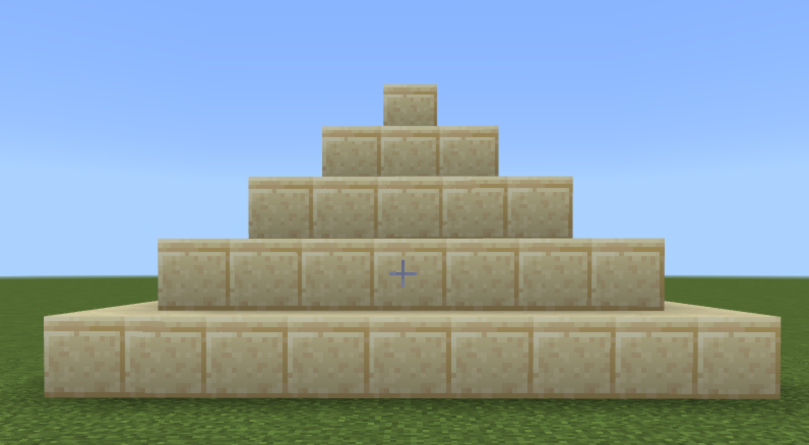

## Піраміда
Код
```js
player.onChat("piramida", function () {
    blocks.fill(
    SMOOTH_SANDSTONE,
    pos(-4, 0, -8),
    pos(4, 0, -16),
    FillOperation.Replace
    )
    blocks.fill(
    SMOOTH_SANDSTONE,
    pos(-3, 1, -9),
    pos(3, 1, -15),
    FillOperation.Replace
    )
    blocks.fill(
    SMOOTH_SANDSTONE,
    pos(-2, 2, -10),
    pos(2, 2, -14),
    FillOperation.Replace
    )
    blocks.fill(
    SMOOTH_SANDSTONE,
    pos(-1, 3, -11),
    pos(1, 3, -13),
    FillOperation.Replace
    )
    blocks.fill(
    SMOOTH_SANDSTONE,
    pos(0, 4, -12),
    pos(0, 4, -12),
    FillOperation.Replace
    )
})
```
Результат:  


#### Творче завдання
1. Як можна побудувати аналогічну піраміду за допомогою циклу?

```js
player.onChat("pyr_cycle", function () {
    for (let i = 0; i <= 4; i++) {
        blocks.fill(
        SMOOTH_SANDSTONE,
        pos(-4 + i, i, -8 - i),
        pos(4 - i, i, -16 - i),
        FillOperation.Replace
        )
    }
})
```

2. Які ще варіанти циклу можна використати?
3. Побудуйте піраміду більших розмірів та іншого будівельного матеріалу.