# Події
На початку занять - відпрацюємо створення елементів, які можуть сигналізувати про прохід агенту чи гравця в певній точці.
## Феєрверки
Побудуйте систему запуску феєрверків з **дубовими притискними пластинами**, **пилом редстоуну** та **розподілювачами**.
   
До розподілювачів завантажимо феєрверки.
  
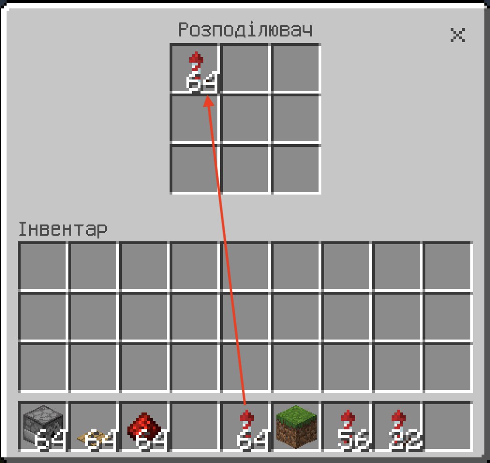 

Сформуємо код, який дозволяє поставити агента навпроти створених притискних панелей.  
**Code01**
```js
player.onChat("tp", function () {
    agent.teleportToPlayer()
})
```
**Code02**
```js
player.onChat("l", function () {
    agent.turn(LEFT_TURN)
})
```
**Code03**
```js
player.onChat("go", function () {
    for (let index = 0; index < 15; index++) {
        agent.move(FORWARD, 1)
    }
})
```

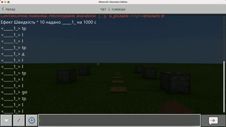

## Липкий поршень
Створіть систему з притискних панелей, пилу редстоуну, липкого поршню та блок смарагду.  
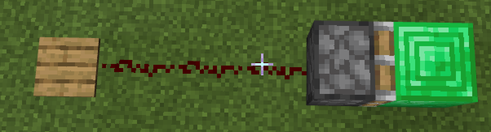   
Перевірьте роботу створеної системи.  
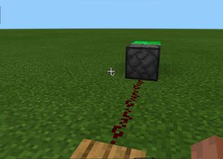   
Визначіть координати поруч із блоку смарагду (-30;4;-99)
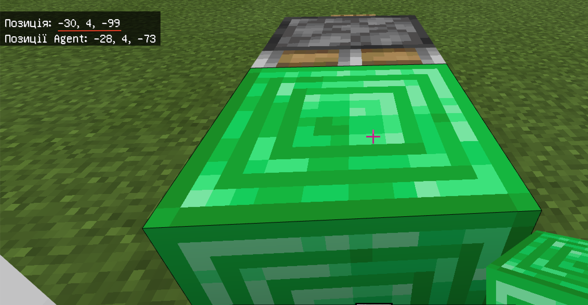   
Сформуйте код, який контролює наявність блоку смарагду у визначених координатах (-30;4;-99).  

**Code04**
```js
loops.forever(function () {
    if (blocks.testForBlock(EMERALD_BLOCK, world(-30, 4, -99))) {
        player.say(":)")
    }
})

```

Перевірьте роботу відповідного елементу.  
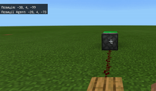  

### Події
|#|Завдання|Код|Результат|
|---|---|---|---|
|1.|1. Виведіть на екран символи ":-)" при натисканні нажимної панелі (із висування).<br> 2. Виведіть на екран символи "!" при натисканні нажимної панелі.<br> 3. Виведіть поточний ігровий час при натисканні нажимної панелі. |   <br> **Code04** |  |

## Одна дія
Ви можете побачити в попередньому завданні, що виведення на екран тексту повторюється декілька разів. Для того, щоб дія повторювалася лише один раз необхідно використовувати змінну, якій значення задаємо при команді "start".
Встановимо код, якій задає змінній flag значення 0 та вивести на екран повідомлення "(+) Flag activated." 

**Code05**
```js
player.onChat("start", function () {
    flag = 0
    player.say("(+)Flag activated.")
})
```


Додамо умову спрацьовування (знаходження блоку смарагду в точці (-30;4;-99)) та за умови, що змінна flag має значення 0
  

За виконання цих двох умов - змінимо значення змінної flag на 1. В результі дія, що зазначена в даній умові (в нашому випадку це вивід на екран символів ":-)" лише 1 раз.
  
Змінимо текст повідомлення на "(-) Flag deactivated".

**Code06**
```js
loops.forever(function () {
    if (blocks.testForBlock(EMERALD_BLOCK, world(-30, 4, -99)) && flag == 0) {
        flag = 1
        player.say("(-)Flag deactivated")
    }
})

```


Отримаємо результат:  
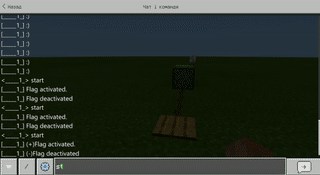 

Для створеної системи з притискної панелі, пилу редстоуну, липкого поршню та блоку смарагду. запрограмуйте наступні дії (зверніть увагу, що в вашому випадку - координати можуть відрізнятися і вам необхідно визначати координати місця, в яке переміщується блок смарагду самостійно):
|#|Завдання|Код|Результат|
|---|---|---|---|
|2|1. Запрограмуйте так, щоб при команді **start** на екран було виведено текст **(+)Flag activated**, а при натисканні панелі -  один раз було виведено **(-)Flag deactivated** <br> 2. Запрограмуйте так, щоб при команді **start** на екран було виведено текст **Action started!**, а при натисканні панелі -  один раз було виведено **Action stoped!** | **Code05** <br> **Code06** | |

### Творче завдання:
1. Задайте самостійно за власним бажанням текст, що буде виводитися на екран при команді чату start та при натисканні нажимної панелі.

## Фіксація розбиття блоку
За команди чату **start2** задамо змінній **flag2** значення **1** та виведемо на екран повідомлення "**start**". А також переносить гравця в точку (-40;4;-90) та розміщує блок алмазу в точці (-45;4;-90)  

**Code07**
```js
player.onChat("start2", function () {
    player.teleport(world(-40, 4, -90))
    blocks.place(DIAMOND_BLOCK, world(-45, 4, -90))
    flag2 = 1
    player.say("Start")
})
```

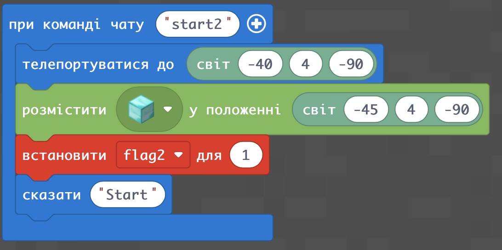

Задамо код, який виводить повідомлення "**finish**", якщо блок алмазу знищити.  


**Code08**  
```js
loops.forever(function () {
    if (!(blocks.testForBlock(DIAMOND_BLOCK, world(-45, 4, -90))) && flag2 == 1) {
        flag2 = 0
        player.say("finish")
    }
})
```

Подивимось на на результат.  
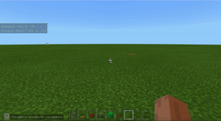

## Фіксація розбиття 2-х блоків
Створимо два блоку: смарагду та алмазу та задамо змінним flag3 та flag4 значення 1, а також виведемо на екран текст "Initialisation"

**Code09** 
```js
player.onChat("Start3", function () {
    player.teleport(world(-60, 4, -90))
    blocks.place(DIAMOND_BLOCK, world(-65, 4, -90))
    blocks.place(EMERALD_BLOCK, world(-65, 4, -92))
    flag3 = 1
    flag4 = 1
    player.say("Initialisation")
})
```
 
При знищенні алмазного блоку напишемо на екрані Start, при знищенні смарагдового - напишемо на екрані Finish   
**Code10** 
```js
loops.forever(function () {
    if (!(blocks.testForBlock(DIAMOND_BLOCK, world(-65, 4, -90))) && flag3 == 1) {
        flag3 = 0
        player.say("Start")
    }
    if (!(blocks.testForBlock(EMERALD_BLOCK, world(-65, 4, -92))) && flag4 == 1) {
        flag4 = 0
        player.say("Finish")
    }
})
```

<!-- 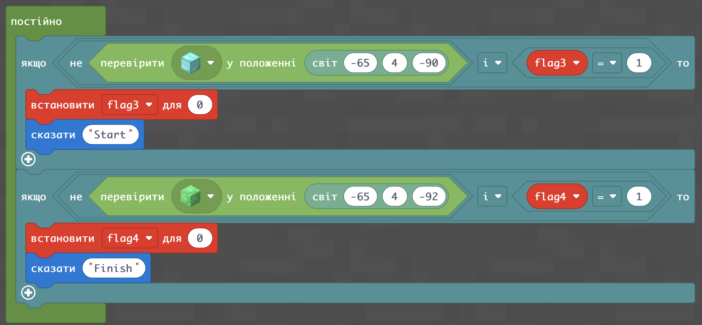   -->

Подивимось на результат   
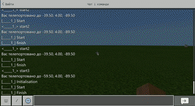


## Використання часу
**Code11** 
```js
player.onChat("Start3", function () {
    player.teleport(world(-60, 4, -90))
    blocks.place(DIAMOND_BLOCK, world(-65, 4, -90))
    blocks.place(EMERALD_BLOCK, world(-65, 4, -92))
    flag3 = 1
    flag4 = 1
    player.say("Initialisation")
})
```

<!--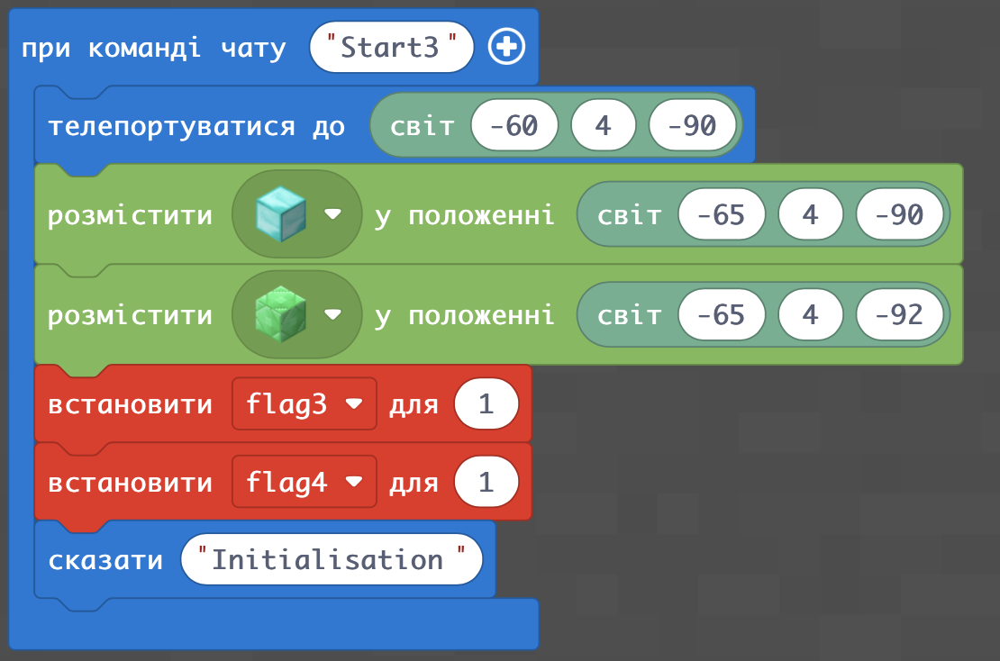    -->
  
**Code12** 
```js
loops.forever(function () {
    if (!(blocks.testForBlock(DIAMOND_BLOCK, world(-65, 4, -90))) && flag3 == 1) {
        flag3 = 0
        player.say("Start")
        timestart = gameplay.timeQuery(GAME_TIME)
    }
    if (!(blocks.testForBlock(EMERALD_BLOCK, world(-65, 4, -92))) && flag4 == 1) {
        flag4 = 0
        player.say(gameplay.timeQuery(GAME_TIME) - timestart)
    }
})
```

<!-- 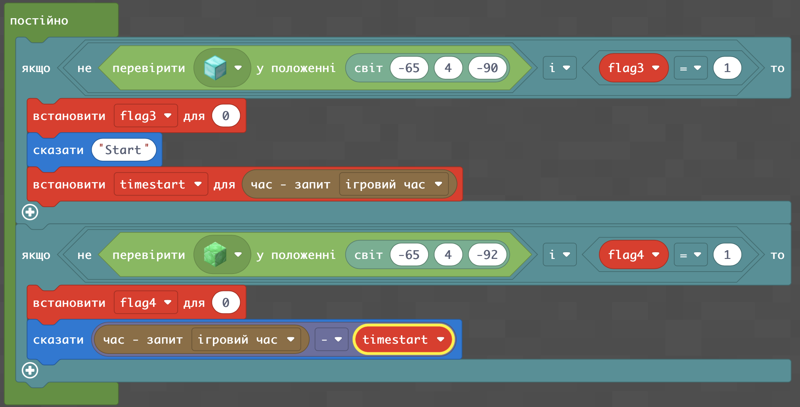    -->

&nbsp;    
  
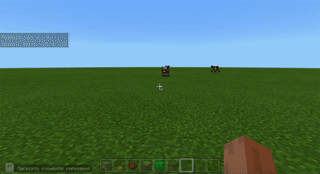   


## Лабіринт
Поновимо лабіринт з попереднього заняття. 

**Code13** 
```js
player.onChat("labirint2", function () {
    mat = GRASS
    for (let індекс2 = 0; індекс2 <= 3; індекс2++) {
        n = 2 * (індекс2 + 1)
        blocks.fill(
        mat,
        world(n, 4, n),
        world(n, 5, 0 - n),
        FillOperation.Replace
        )
        blocks.fill(
        mat,
        world(n, 4, 0 - n),
        world(0 - n, 5, 0 - n),
        FillOperation.Replace
        )
        blocks.fill(
        mat,
        world(0 - n, 4, 0 - n),
        world(0 - n, 5, n),
        FillOperation.Replace
        )
        blocks.fill(
        mat,
        world(0 - n, 4, n),
        world(n, 5, n),
        FillOperation.Replace
        )
    }
})
```

<!-- 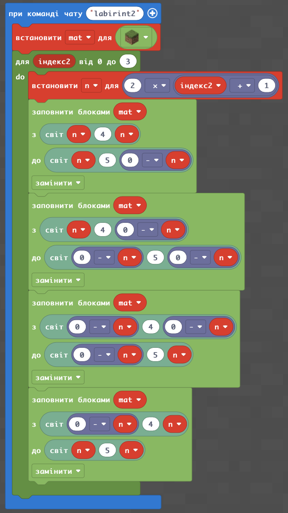 -->

**Code14** 
```js
player.onChat("overlap2", function () {
    blocks.place(PLANKS_OAK, world(0, 4, 3))
    blocks.place(PLANKS_OAK, world(0, 5, 3))
    blocks.place(PLANKS_OAK, world(5, 4, 3))
    blocks.place(PLANKS_OAK, world(5, 5, 3))
    blocks.place(PLANKS_OAK, world(-1, 4, 7))
    blocks.place(PLANKS_OAK, world(-1, 4, 7))
})
```
<!-- 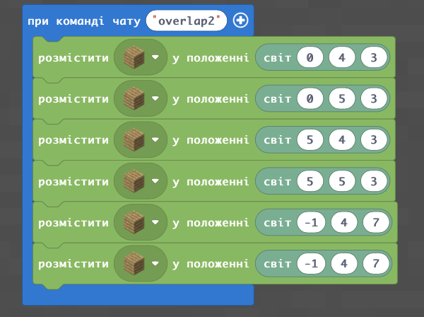 -->

**Code15** 
```js
player.onChat("space2", function () {
    blocks.place(AIR, world(2, 4, 0))
    blocks.place(AIR, world(2, 5, 0))
    blocks.place(AIR, world(4, 4, 2))
    blocks.place(AIR, world(4, 5, 2))
    blocks.place(AIR, world(6, 4, 5))
    blocks.place(AIR, world(6, 5, 5))
    blocks.place(AIR, world(-7, 4, -8))
    blocks.place(AIR, world(-7, 5, -8))
})

```

<!-- 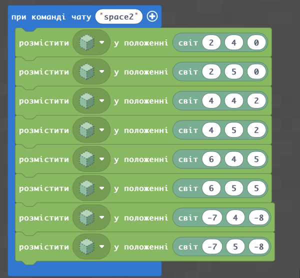  -->

**Code16** 
```js
player.onChat("pointer", function () {
    blocks.place(IRON_BLOCK, world(-7, 3, -7))
    blocks.place(GOLD_BLOCK, world(7, 3, -7))
    blocks.place(GOLD_BLOCK, world(7, 3, 5))
    blocks.place(GOLD_BLOCK, world(-5, 3, 5))
    blocks.place(GOLD_BLOCK, world(5, 3, -5))
    blocks.place(GOLD_BLOCK, world(-5, 3, -5))
    blocks.place(GOLD_BLOCK, world(5, 3, 2))
    blocks.place(GOLD_BLOCK, world(3, 3, 2))
    blocks.place(IRON_BLOCK, world(3, 3, 0))
    blocks.place(REDSTONE_BLOCK, world(0, 3, 0))
})
```
<!--   -->


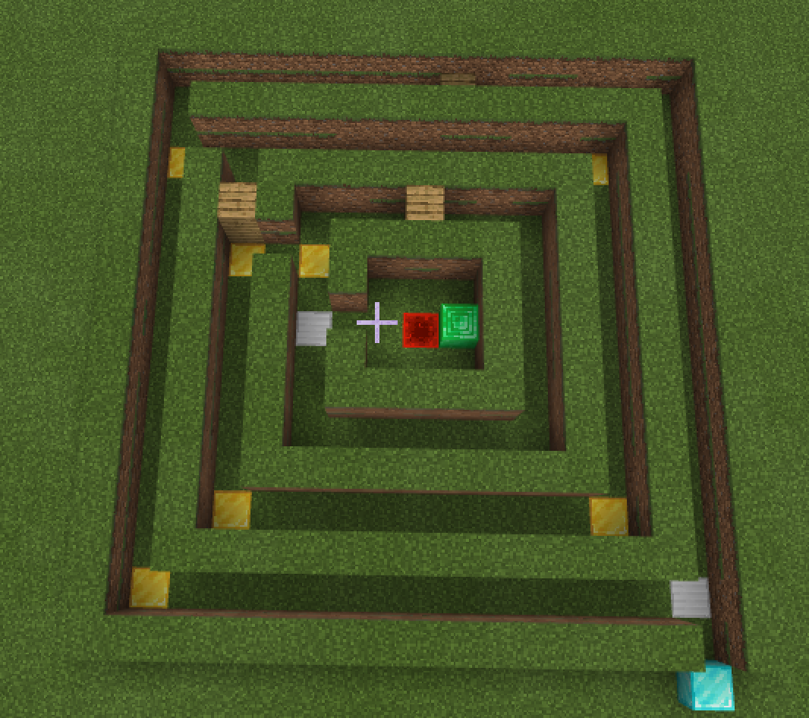  

**Code17** 

```js
player.onChat("start4", function () {
    player.teleport(world(-7, 4, -11))
    blocks.place(DIAMOND_BLOCK, world(-7, 4, -9))
    blocks.place(EMERALD_BLOCK, world(-1, 4, 0))
    flag5 = 1
    flag6 = 1
    player.say("Initialisation")
})
```

<!-- 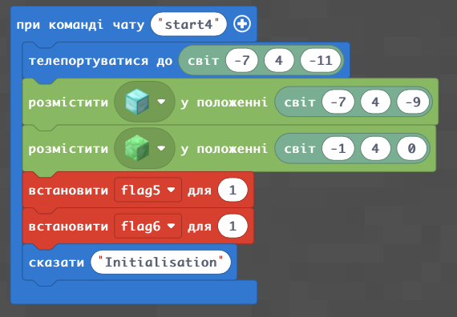  -->

**Code18** 
```js
loops.forever(function () {
    if (!(blocks.testForBlock(DIAMOND_BLOCK, world(-7, 4, -9))) && flag5 == 1) {
        flag5 = 0
        player.say("Start")
        timestart = gameplay.timeQuery(GAME_TIME)
    }
    if (!(blocks.testForBlock(EMERALD_BLOCK, world(-1, 4, 0))) && flag6 == 1) {
        flag6 = 0
        player.say(gameplay.timeQuery(GAME_TIME) - timestart)
        gameplay.setDifficulty(EASY)
        mobs.spawn(mobs.monster(ZOMBIE), world(0, 4, 0))
    }
})


```
<!-- 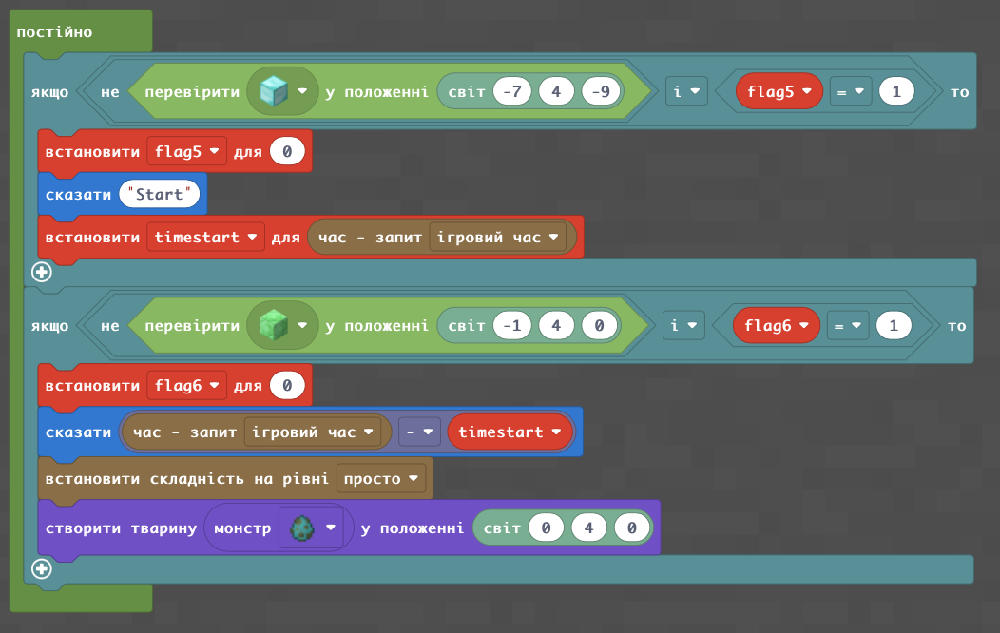  -->
  

