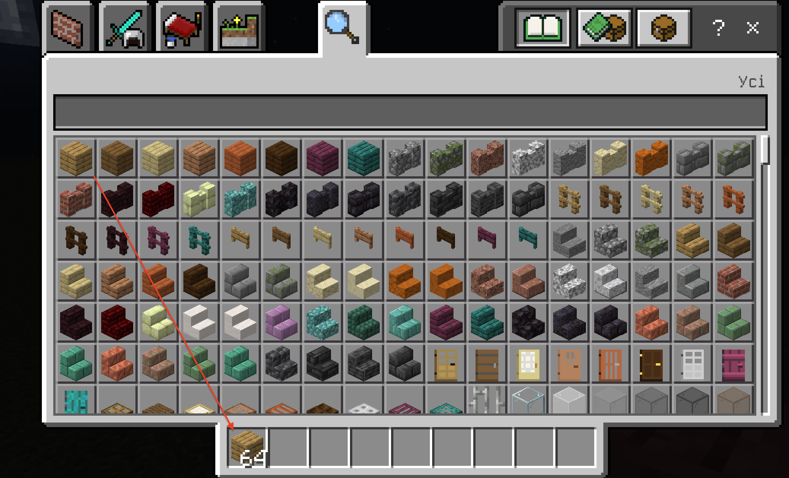

# Перше заняття.
На першому занятті - дуже важливо показати, як керувати гравцем (пересування, стрибки, тощо). 
Далі - важливо показати роботу із інвентарем та отримання необхідних предметів. 

## Наполните бассейн водой

