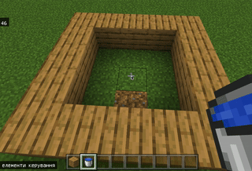

# Перше заняття.
На першому занятті - дуже важливо показати, як керувати гравцем (пересування, стрибки, тощо). 
Далі - важливо показати роботу із інвентарем та отримання необхідних предметів. 

## Наповніть бассейн водою

## Обрахування.
Візьміть собі золоті блоки:  

Візьміть собі алмазні блоки:  

#### Завдання
1. Розмістіть на полі 2 золотих та 3 діамантових блоків.

2. Розмістіть на полі 3 золотих та 2 діамантових блоків.
3. Розмістіть на полі 5 золотих та 5 діамантових блоків.
4. В цілому маєте 7 золотих та алмазинх блоків, 4 з яких золоті, скільки блоків алмазних блоків. Створіть відповідну кількість на екрані.

